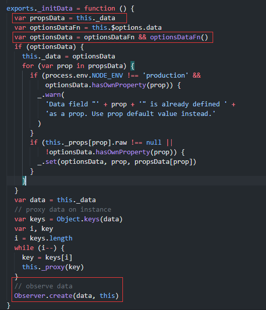

`Dep`类的作用是收集依赖，当`Observer`观察的数据变化时，通知这些依赖。所以它必须有一个`notify`方法用于通知所有观察者去对数据更新做出响应。正因如此，每个观察者必须有一个`update`方法用于响应被观察数据的变化。

***

`Observer`类在观察数组时，是通过拦截数组的写操作api实现的，拦截的写操作有：
- push
- pop
- shift
- unshit
- splice
- sort
- reverse

并且，`Observer`并不会去改写`Array`的原型链，而是直接改变数组对象的`__proto__`属性。

***

`Vue`对象在初始化时，会去解析选项对象的`data`字段，如果它是一个函数，则执行它。`data`最终会生成一个对象，这个对象会被赋值给`Vue`对象的`_data`字段，然后会使用`Observer`对象来观察这个生成的data，这就将data托管到了响应式系统中。关键代码如下：

***

`Vue`对象中，所有以`_`开头的字段，都是内部字段，用来处理内部问题的，不要将其视为Vue的api。